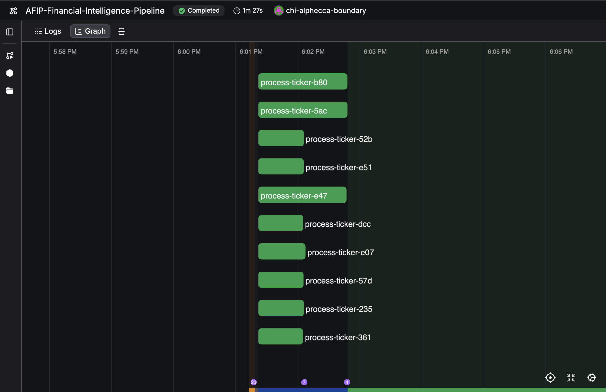

# AFIP — Autonomous Financial Intelligence Pipeline

Pulls SEC 10-K filings for any public company, extracts structured debt and risk data using an LLM, verifies the output, and saves it as clean JSON. Runs on a schedule, has a dashboard, and works out of the box with a free Groq API key.

---

## How it works

```
┌─────────────────────────────────────────────────────────────────┐
│                         YOU PROVIDE                             │
│                    a ticker symbol (e.g. AAPL)                  │
└──────────────────────────┬──────────────────────────────────────┘
                           │
                           ▼
              ┌────────────────────────┐
              │      INGEST NODE       │
              │  Downloads 10-K filing │
              │  from SEC EDGAR        │
              │  (rate-limited)        │
              └────────────┬───────────┘
                           │ raw HTML filing
                           ▼
              ┌────────────────────────┐
              │      PARSE NODE        │
              │  HTML → Markdown       │
              │  Extracts Item 8       │
              │  (Financial Data) and  │
              │  Item 1A (Risk Factors)│
              └────────────┬───────────┘
                           │ clean markdown
                           ▼
              ┌────────────────────────┐
              │   MAPPING AGENT NODE   │
              │  Llama 3.3 70B (Groq)  │
              │  reads the filing and  │
              │  extracts structured   │
              │  debt + risk data      │
              └────────────┬───────────┘
                           │ raw LLM output
                           ▼
              ┌────────────────────────┐
              │      JUDGE NODE        │
              │  Runs 5 checks:        │
              │  confidence, XBRL,     │
              │  dates, completeness,  │
              │  amount sanity         │
              └────────────┬───────────┘
                           │
              ┌────────────┴───────────┐
           PASS                      FAIL
              │                        │
              │                 retries left?
              │                  YES  │  NO
              │                   │   └──► save as unverified
              │                   └──► back to Mapping Agent
              │                         (with critique feedback)
              ▼
┌─────────────────────────────────────┐
│           STORAGE NODE              │
│  data/output/AAPL_2025-09-27_       │
│  verified.json  +  _risks.md        │
└─────────────────────────────────────┘
```

The pipeline is built with **LangGraph** (stateful agent graph), orchestrated by **Prefect 3** (scheduling + retries), and surfaced through a **Streamlit** dashboard.

---

## Quick Start

### 1. Prerequisites

- Python 3.10+
- A free [Groq API key](https://console.groq.com) (takes 30 seconds to get)

### 2. Install

```bash
git clone <repo-url> afip
cd afip
python3 -m venv .venv
source .venv/bin/activate      # Windows: .venv\Scripts\activate
pip install -r requirements.txt
```

### 3. Configure

```bash
cp .env.example .env
```

Open `.env` and fill in the two required values:

```bash
GROQ_API_KEY=gsk_...                          # from console.groq.com
SEC_USER_AGENT=Firstname Lastname email@domain.com   # your real contact info (SEC requires this)
```

Everything else has sensible defaults.

### 4. Verify your config

```bash
python3 -c "from config.settings import config; config.validate(); print(config.summary())"
```

### 5. Run it

```bash
# Single ticker
python scripts/run_single.py AAPL

# Multiple tickers
python scripts/batch_run.py AAPL MSFT GOOGL

# Dashboard
streamlit run dashboard.py
```

---

## What you get

For each ticker, the pipeline writes a verified JSON file:

```json
{
  "ticker": "AAPL",
  "filing_type": "10-K",
  "period_ending": "2025-09-27",
  "debt_instruments": [
    {
      "name": "3.45% Notes due 2024",
      "amount": 1000.0,
      "currency": "USD",
      "maturity_year": 2024,
      "xbrl_tag": "us-gaap:LongTermDebt"
    }
  ],
  "risks_summary": "- Competition: ...\n- Regulatory: ...",
  "confidence_score": 0.95,
  "_pipeline_metadata": {
    "ingested_at": "2026-02-19T17:05:22Z",
    "retry_count": 1,
    "is_verified": true,
    "llm_provider": "groq",
    "llm_model": "llama-3.3-70b-versatile"
  }
}
```

And a `_risks.md` file with the extracted risk factor summary.

---

## Project Structure

```
afip/
├── dashboard.py              # Streamlit UI — browse, run, compare tickers
├── prefect_flow.py           # Prefect 3 flow for scheduled deployments
├── tickers.txt               # Default watchlist (edit to add your own)
├── requirements.txt
├── .env.example              # ← copy to .env and fill in your keys
│
├── src/
│   ├── schemas.py            # Pydantic models: FinancialProfile, PipelineState
│   ├── graph.py              # LangGraph pipeline + run_pipeline()
│   ├── nodes/
│   │   ├── ingest_node.py    # Downloads SEC filing (rate-limited)
│   │   ├── parse_node.py     # HTML → Markdown, section extraction
│   │   ├── mapping_agent.py  # LLM extraction agent
│   │   ├── judge_node.py     # 5-check verifier + retry routing
│   │   └── storage_node.py   # Saves verified JSON + Markdown
│   └── utils/
│       ├── logger.py         # Loguru logging
│       ├── rate_limiter.py   # Token-bucket limiter (SEC: 10 req/s)
│       ├── xbrl_utils.py     # XBRL tag parsing and validation
│       ├── file_utils.py     # Atomic file I/O
│       └── prompt_builder.py # LLM prompt templates
│
├── config/
│   └── settings.py           # All config loaded from environment variables
│
├── scripts/
│   ├── run_single.py         # CLI: run one ticker
│   ├── batch_run.py          # CLI: run many tickers
│   └── inspect_output.py     # CLI: view saved outputs
│
├── tests/
│   ├── conftest.py
│   └── test_pipeline.py      # 35+ unit tests (LLM is mocked — no API key needed)
│
├── notebooks/
│   └── AFIP_Colab_Quickstart.ipynb
│
└── data/                     # Created at runtime (gitignored)
    ├── filings/              # Raw SEC filings
    ├── output/               # Verified JSON + Markdown outputs
    ├── archive/              # Archived filings (optional)
    └── checkpoints/          # LangGraph state (crash recovery)
```

---

## CLI Reference

```bash
# Single ticker
python scripts/run_single.py AAPL
python scripts/run_single.py AAPL --dry-run    # use cached filing, skip download
python scripts/run_single.py AAPL --verbose    # debug logging

# Batch
python scripts/batch_run.py AAPL MSFT GOOGL
python scripts/batch_run.py --watchlist        # uses DEFAULT_TICKERS in batch_run.py
python scripts/batch_run.py --from-file tickers.txt

# Inspect outputs
python scripts/inspect_output.py AAPL          # full JSON
python scripts/inspect_output.py AAPL --debt   # debt instruments only
python scripts/inspect_output.py AAPL --risks  # risk summary only
python scripts/inspect_output.py --all         # summary table of all tickers

# Tests (no API keys needed)
pytest tests/ -v
pytest tests/ --cov=src --cov-report=term-missing
```

---

## Environment Variables

| Variable | Required | Default | Description |
|---|---|---|---|
| `GROQ_API_KEY` | **Yes** | — | Free at [console.groq.com](https://console.groq.com) |
| `SEC_USER_AGENT` | **Yes** | — | `"Firstname Lastname email@domain.com"` — SEC requires this |
| `LLM_PROVIDER` | No | `groq` | `groq` or `ollama` (local) |
| `LLM_MODEL` | No | `llama-3.3-70b-versatile` | Any model available on your provider |
| `CONFIDENCE_THRESHOLD` | No | `0.85` | Min score to mark output as verified (0.0–1.0) |
| `MAX_RETRY_LOOPS` | No | `3` | Max LLM retry attempts per filing |
| `DRY_RUN` | No | `false` | Skip SEC download, use cached filing |
| `SAVE_LLM_RAW_RESPONSE` | No | `false` | Save raw LLM output to `data/output/debug/` |

See `.env.example` for the full list with comments.

---

## LangSmith Tracing (optional)

To get full visibility into every LLM call, retry loop, and node execution, add your [LangSmith](https://smith.langchain.com) key to `.env`:

```bash
LANGCHAIN_TRACING_V2=true
LANGCHAIN_API_KEY=ls_...
LANGCHAIN_PROJECT=afip
```

LangGraph picks this up automatically — no code changes needed.

---

## Prefect DAG — Live Run

10 tickers processed concurrently, all verified in under 2 minutes.



---

## Scheduled Deployment (Prefect Cloud)

```bash
prefect cloud login
python prefect_flow.py deploy
# Registers a Mon–Fri 17:00 ET schedule in your Prefect Cloud workspace
```

---

## Google Colab

Open `notebooks/AFIP_Colab_Quickstart.ipynb` in Colab for a step-by-step walkthrough. The notebook installs dependencies and runs a full pipeline end-to-end — no local setup needed.
